# ISH.UZ — Arxitektura

> "Ish qidirmang. O'zingizga mos ishni toping."
> "Ko'p CV ko'rmang. Sizga mos xodimni toping."

## 1. Platformalar va yagona backend

```
                 ┌──────────────────────────────────────────────┐
                 │                 Supabase                     │
                 │  PostgreSQL 17 · Auth · Storage · Realtime   │
                 │  RLS · SQL funksiyalar (RPC) · Edge/Route    │
                 └───────────────┬──────────────────────────────┘
                                 │  supabase-js (anon key + JWT)
     ┌───────────────┬───────────┴───────────┬───────────────────┐
     │ Web App       │ Telegram Mini App     │ Android / iOS     │ Admin Panel
     │ Next.js 16    │ o'sha Next.js build,  │ PWA (hozir) →     │ Next.js /admin
     │ (mobile-first)│ /tg layout + initData │ Expo RN (keyin)   │ desktop-first
     └───────────────┴───────────────────────┴───────────────────┘
```

* Bitta `profiles` yozuvi = bitta odam. Telegram, telefon (OTP) yoki keyinchalik Google/Apple orqali kirsa ham **o'sha** profil.
* Barcha biznes-mantiq server tomonda: Postgres funksiyalar (`security definer` RPC), RLS va Next.js Route Handler'lar. Client'dagi rol/holatga ishonilmaydi.
* Telegram bot tokeni faqat serverda (`TELEGRAM_BOT_TOKEN`), initData imzosi serverda tekshiriladi (`/api/auth/telegram`).

## 2. Rollar

| Rol | Manba | Izoh |
|---|---|---|
| Ish qidiruvchi (`worker`) | `user_roles` + `worker_profiles` | Bir profil bir vaqtda ikkala rolga ega bo'lishi mumkin |
| Ish beruvchi (`employer`) | `user_roles` + `employer_profiles` (+ `companies`, `company_members`) | Kompaniya, YaTT yoki oddiy shaxs |
| Admin | `admin_users` (SUPER_ADMIN / ADMIN / MODERATOR / SUPPORT) | RBAC — `admin_users.permissions` |

`profiles.active_role` foydalanuvchi oxirgi tanlagan rejim (UI qaysi bottom-nav'ni ko'rsatishini hal qiladi).

## 3. Kod tuzilishi (feature-based)

```
src/
  app/                       Next.js App Router — faqat routing + layout
    (public)/                / , /jobs, /jobs/[slug], /workers, /workers/[id], /company/[slug]
    (auth)/auth              telefon OTP + Telegram
    (app)/                   login talab qiladigan sahifalar (worker + employer)
    admin/                   admin panel (desktop-first)
    api/                     route handlers: telegram auth, bot webhook, cv pdf
  features/                  har bir modul: components/ + queries/ + actions/ + schema.ts
    auth/  onboarding/  worker/  employer/  vacancies/  applications/  offers/
    matching/  chat/  notifications/  saved/  reviews/  reports/  admin/
  components/ui/             design system (shadcn uslubi, radix-ui + cva)
  components/shared/         WorkerCard, VacancyCard, MatchScore, EmptyState, Stepper ...
  lib/
    supabase/                server.ts · client.ts · admin.ts · middleware.ts
    i18n/                    t(), locale, messages/uz.json ru.json
    format/                  money (5 000 000 so'm), phone (+998 XX XXX XX XX), date (Asia/Tashkent)
    telegram/                initData verify, bot API
  types/database.types.ts    `supabase gen types` natijasi
supabase/
  migrations/                0001_extensions … 0009_seed
  tests/                     RLS ssenariylari (psql)
messages/uz.json, ru.json   barcha UI matnlar
```

## 4. Ma'lumotlar modeli (ERD)

```mermaid
erDiagram
  profiles ||--o{ user_roles : has
  profiles ||--o| worker_profiles : "worker"
  profiles ||--o| employer_profiles : "employer"
  profiles ||--o| telegram_accounts : links
  profiles ||--o{ device_tokens : has
  profiles ||--o{ notifications : receives
  profiles ||--o| admin_users : "may be"

  companies ||--o{ company_members : has
  profiles ||--o{ company_members : "member of"
  employer_profiles }o--o| companies : "belongs to"

  categories ||--o{ subcategories : has
  categories ||--o{ skills : suggests
  regions ||--o{ districts : has

  worker_profiles ||--o{ worker_skills : has
  worker_profiles ||--o{ worker_experience : has
  worker_profiles ||--o{ worker_education : has
  worker_profiles ||--o{ worker_portfolio : has
  worker_profiles ||--|| worker_preferences : has
  worker_profiles ||--o{ worker_locations : "can work in"
  worker_profiles ||--o{ worker_languages : speaks
  skills ||--o{ worker_skills : ""

  vacancies }o--|| profiles : "owner"
  vacancies }o--o| companies : "posted by"
  vacancies ||--o{ vacancy_skills : requires
  vacancies ||--o{ vacancy_languages : requires
  vacancies ||--o{ vacancy_benefits : offers
  vacancies }o--|| categories : in
  vacancies }o--o| subcategories : in

  vacancies ||--o{ applications : receives
  worker_profiles ||--o{ applications : sends
  applications ||--o{ application_events : timeline

  vacancies ||--o{ job_offers : ""
  worker_profiles ||--o{ job_offers : receives
  profiles ||--o{ job_offers : "employer sends"

  worker_profiles ||--o{ saved_vacancies : saves
  profiles ||--o{ saved_workers : saves
  worker_profiles ||--o{ matches : ""
  vacancies ||--o{ matches : ""

  conversations ||--o{ conversation_members : has
  conversations ||--o{ messages : has
  applications |o--o| conversations : opens
  job_offers |o--o| conversations : opens

  profiles ||--o{ reviews : writes
  profiles ||--o{ reports : files
  profiles ||--o{ verification_requests : submits
  admin_users ||--o{ audit_logs : writes
```



Asosiy qoidalar:

* **`profiles`** — umumiy identitet (`id = auth.users.id`). Rolga xos ma'lumot alohida jadvallarda, dublikat yo'q.
* **Telefon maxfiyligi** — `profiles.phone` hech qachon to'g'ridan-to'g'ri o'qilmaydi. `profiles.phone_visibility` (`nobody | applicants | on_request | everyone`) va `public.can_view_phone(viewer, owner)` funksiyasi hal qiladi; UI `get_contact(profile_id)` RPC orqali oladi.
* **Joylashuv** — foydalanuvchi profilida faqat viloyat/tuman ko'rinadi. Aniq koordinata (`worker_profiles.location` geography) faqat masofa hisoblash uchun, RLS bilan yashirilgan; `distance_km` RPC natijasida qaytadi.
* **Vakansiya holati** — `draft → pending_review → active → paused → closed → expired`, admin `hidden`/`rejected` qila oladi.
* **Ariza holati** — `sent → viewed → shortlisted → interview → offered → hired | rejected | withdrawn`; har o'zgarish `application_events` ga yoziladi (timeline).
* **Chat** faqat ariza yoki taklif mavjud bo'lganda ochiladi (`conversations.application_id` yoki `job_offer_id` majburiy, DB darajasida check).
* **Bildirishnomalar** DB trigger'lari orqali yaratiladi (`notifications`), Realtime orqali UI ga, `telegram_accounts` bo'lsa route handler bot orqali yuboradi.
* **Matching** — `matches` jadvali kesh; hisoblash `src/features/matching/engine.ts` (pure TS, testlanadi) va `public.compute_match(worker_id, vacancy_id)` SQL (ro'yxatlarni saralash uchun). Interfeys AI modelga almashtirishga tayyor (`MatchEngine` interface).

## 5. Xavfsizlik modeli

* Har jadvalda RLS yoqilgan. `service_role` faqat server (route handler / cron) da.
* Yordamchi funksiyalar: `auth_uid()`, `is_admin(perm)`, `is_company_member(company_id)`, `owns_worker(worker_id)`, `can_view_phone(owner)`.
* Ish beruvchi nomzodning telefonini faqat: nomzod uning vakansiyasiga ariza yuborgan bo'lsa, yoki nomzod ruxsat bergan bo'lsa (`contact_grants`), yoki `everyone` bo'lsa ko'radi.
* Admin harakatlari `audit_logs` ga trigger/RPC orqali yoziladi.
* Yuklashlar: Storage bucket'lar `avatars`, `portfolio`, `company-logos`, `chat`, `documents`; MIME/size cheklovi bucket darajasida.
* Rate limiting: `rate_limits` jadvali + `check_rate_limit(key, limit, window)` RPC (ariza, xabar, hisobot uchun).

## 6. Bosqichlar

1. Sxema + RLS + seed → 2. Auth + i18n + design system → 3. Worker flow → 4. Employer flow → 5. Matching → 6. Applications/Offers → 7. Chat + Notifications → 8. Admin → 9. Telegram Mini App → 10. Test + deploy.
